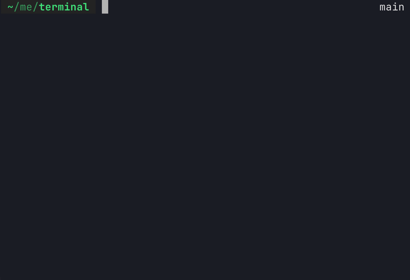

# crabby 🦀



A lightweight & ergonomic shell written in Rust

## Features

- Integration with major terminal emulators
- Command history with ergonomic fuzzy explorer
- Shift (ctrl in some terminal emulators) + arrow keys to fast move around text buffers
- Tab completions for commands and file-paths
- Bash syntax, command piping and background processes
- Partial rewrite of the bash scripting language
- Environment variable management
- Configurable 24 bit colorschemes

## Building from source

Assuming `rustc >= 1.80.1`
```
git clone https://github.com/jjflash95/crabby
cd crabby
cargo build --release
```

The binary will be available in `./target/release/crabby`

Default path for `.rc` file is `~/.cshrc`

## Builtins
 - `cd <directory>` Change current working directory
 - `export [<VAR1=VALUE> [<VAR2=VALUE> ...[]]]` export environment variables
 - `set [<VAR1=VALUE> [<VAR2=VALUE> ...[]]]` same as export but local to the session (supports direct call or implicit, i.e: `CWD=/my/dir` is equal to `set CWD=/my/dir`)
 - `source` source a shell file (not all shell scripting features are implemented)
 - `history [--save] [--reload]` saves this sessions cmd history to the .history file, or reloads from file, if args is empty will print location of .history file
 - `colorscheme [default] [dark]...` changes the colorscheme to a builtin or loads from custom file
 - `exit` yes

